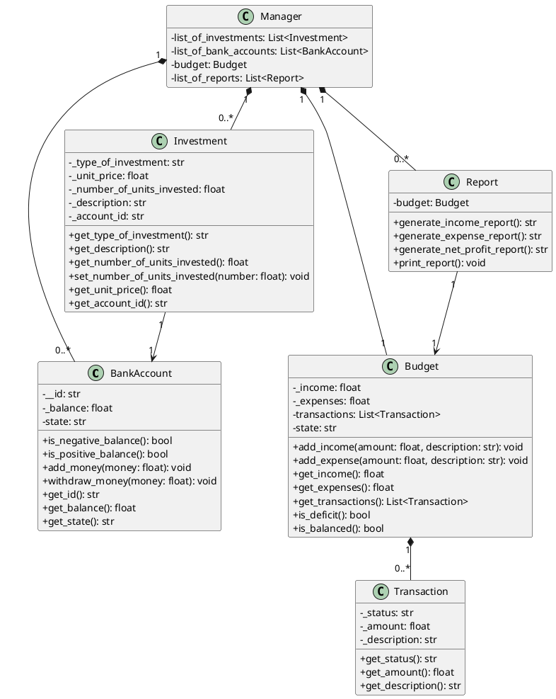
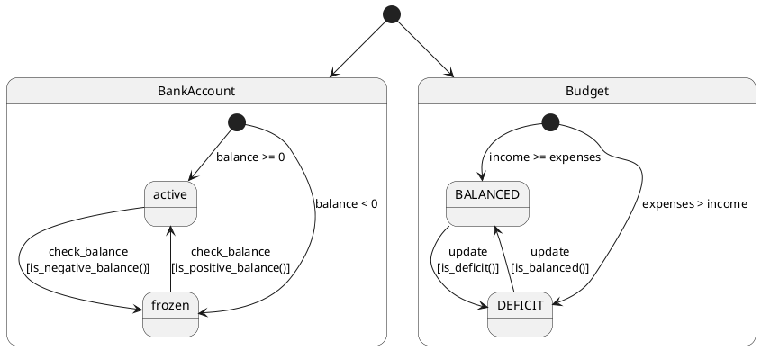

# Документация программной системы для мониторинга финансов

## Описание системы

Программная система предназначена для отслеживания и анализа финансовых операций. Она включает управление банковскими счетами, бюджетирование, инвестиции и генерацию финансовых отчетов.

## Основные сущности

1. **BankAccount** - представляет банковский счет с возможностью пополнения и снятия средств.
2. **Budget** - управляет доходами и расходами, а также анализирует финансовое состояние.
3. **Investment** - описывает инвестиции, такие как акции, криптовалюта или ценные металлы.
4. **Transaction** - представляет финансовую операцию (доход или расход).
5. **Report** - генерирует отчеты о доходах, расходах и чистой прибыли.
6. **Manager** - центральный класс, управляющий всеми компонентами системы.

## Диаграмма классов

## Диаграмма состояний

## Основные функции системы

### Управление банковскими счетами
- **Добавление счета**: Создание нового банковского счета с начальным балансом.
- **Пополнение счета**: Добавление средств на выбранный счет.
- **Снятие средств**: Снятие денег с выбранного счета.

### Управление бюджетом
- **Добавление дохода**: Регистрация дохода с указанием суммы и описания.
- **Добавление расхода**: Регистрация расхода с указанием суммы и описания.
- **Анализ бюджета**: Расчет чистой прибыли (доходы минус расходы).

### Управление инвестициями
- **Добавление инвестиции**: Регистрация новой инвестиции с указанием типа, количества единиц и цены за единицу.
- **Списание средств**: Автоматическое списание средств с выбранного счета при добавлении инвестиции.

### Генерация отчетов
- **Отчет о доходах**: Список всех доходов с указанием суммы и описания.
- **Отчет о расходах**: Список всех расходов с указанием суммы и описания.
- **Отчет о чистой прибыли**: Расчет и отображение чистой прибыли.
